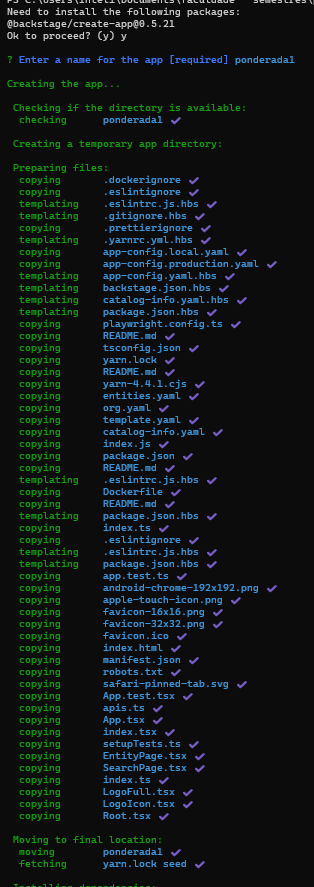

# ponderada-semana1-prog
## Deploying backstage on docker

## Configuração e Execução do Backstage com Docker

Este documento fornece um guia passo a passo para compilar e executar uma instância do Backstage utilizando Docker, incluindo prints que evidenciam a aplicação em execução.


## Passos

### 1. Criar um app backstage
No terminal, execute:

```bash
npx @backstage/create-app@latest
```


### 2. Rodar o projeto
Construa a imagem Docker com o seguinte comando:

```bash
yarn dev
```

### 3. Acessar o catálogo de serviços

Imagem 1: Backstage em execução no Docker

Imagem 2: Acesso ao catálogo de serviços
